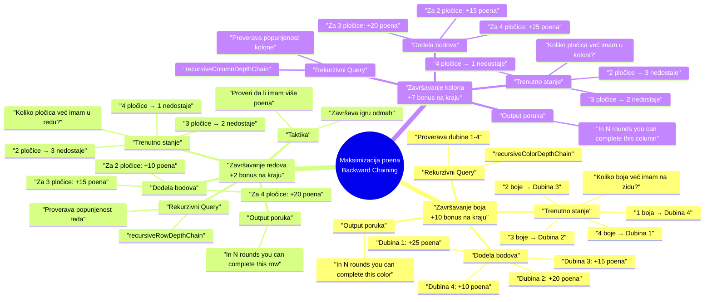
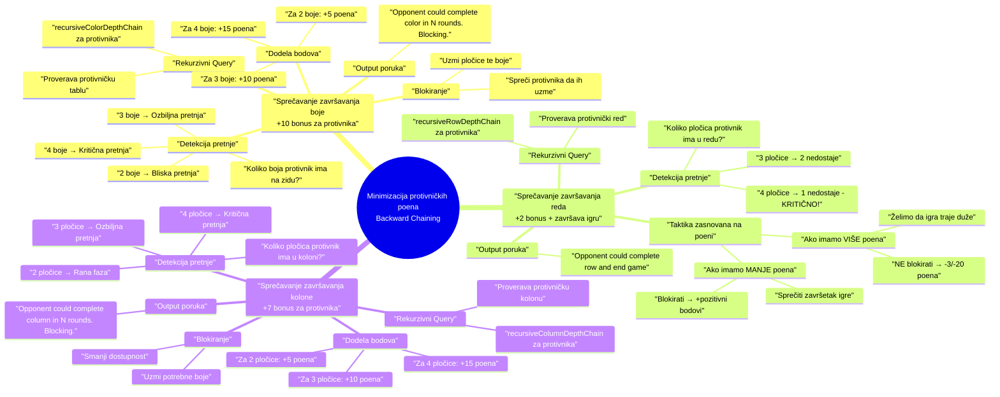

# AIZUL - Ekspertski sistem za igranje društvene igre Azul

Članovi tima:
- Boris Markov SV73/2021
- Gojko Vučković SV49/2021

# Opis problema

### Motivacija

Tokom poslednje decenije industrija društvenih igara je postala mnogo razvijenija i pristupačnija prosečnom čoveku. Razvijaju se nove i moderne društve igre različitih kompleksnosti koje vrlo brzo postaju "kultni klasici" na policama kolekcionara, porodica, pa i povremenih igrača. Jedna od ovih igara, koju bismo želeli da istaknemo je upravo ***Azul*** iz 2017. godine. Smatramo da ova igra ima veliku kompleksnost i različite zanimljive strategije igranja, ali sa vrlo jednostavnim pravilima igranja. Detaljnije o igri možete pročitati [ovde](https://en.wikipedia.org/wiki/Azul_(board_game)).

Obojica volimo ovu igru i često je igramo, sa time u vidu, želimo da odamo počast ***Azul***-u i približimo ljudima time što ćemo napraviti pametnog agenta, uz kojeg će ljudi moći da interaktivno nauče da je igraju, ili unapređuju svoje veštine.

- - -
### Pregled problema

Ukratko, pravila igre su sledeća:

- Igrači skupljaju pločice (keramičke pločice različitih boja i dezena) i postavljaju ih na svoju ličnu tablu sa ciljem da ukrase zid palate. U svakoj rundi postoje krugovi („fabrike“) iz kojih se biraju pločice. Kada je igrač na potezu, on izabere sve pločice iste boje iz jedne fabrike i prenese ih na jednu od svojih redova za pripremu. Sve ostale pločice iz te fabrike premeštaju se u centralni krug i odatle ih kasnije igrači mogu uzimati.

- Kada se svi krugovi isprazne, završava se runda i pločice iz popunjenih redova na tabli se premeštaju na odgovarajuće mesto na „zid“. Svaka postavljena pločica donosi poene u zavisnosti od toga koliko se dobro uklapa sa već postavljenim pločicama (horizontalno i vertikalno povezivanje). Ploče koje ne mogu da se smeste idu na „kaznenu liniju“ i oduzimaju poene.

- Igra traje dok neki igrač ne popuni jedan horizontalni red na svom zidu. Nakon toga sledi završno bodovanje – dodatni poeni se dobijaju za kompletne redove, kolone ili svih pet pločica iste boje. Pobednik je igrač sa najviše osvojenih poena.

*Slika 1 - Prikaz jednog stanja table igrača*

Nalik šahu, pravila igre su prilično jednostavna, međutim postoji bezbroj različitih strategija za igranje i odabir najboljeg poteza može biti vrlo kompleksan. Sa time, želimo da napravimo agenta sa osnovnom funkcionalnošću da odredi najbolji mogući potez u datom stanju table.

Većina implementacija ekspertskih sistema za igranje tabličnih igara poput ***Azul*** su zasnovana na algoritmima poput ***minimax***, ***Monte Carlo Tree Search*** ili ***mašinskog učenja***. Interaktivni sistemi koji su namenjeni da objasne i nauče igrače da igraju se često zadržavaju samo na jednoj rundi (ili par njih) koja je skoro uvek unapred predodređena i linearna bez prilike za učenje kompleksnih strategija. Sa time, naš projekat bi zasnovali na *pravilima*, *forward i backwards chaining*, i *complex event processing* (za šta smatramo da je ***Azul*** naročito pogodan), sa funkcionalnošću da **objasni odluku svog poteza koji smatra optimalnim**. Verujemo da će ovakav pristup omogućiti korisnicima da bolje nauče da igraju ***Azul*** od drugih već postojećih rešenja.

Primeri implementacija, inspiracije i relevantna literatura:
1. [AlphaGo - program koji igra tabličnu igru Go](https://deepmind.google/research/projects/alphago/)
2. [AzulAI - *"program koji igra Azul bolje od čoveka"*](https://domwil.co.uk/posts/azul-ai/#comparison)
3. [The Design of Azul - analiza i tekst o tome šta je dobar izbor u igrama](https://jboger.medium.com/the-design-of-azul-8ab36d21d3a5)

- - -
### Metodologija rada

Sistem je podeljen u tri koherentna sloja koji rade zajedno:

1. Forward Chaining Layer
- Lanac pravila kroz koji će svaki od mogućih poteza proći, u njemu uključujemo taktičko i strateško rezonovanje. On će sadržati pet pravila koja dodeljuju ili oduzimaju bodove po kojima određujemo koliko je potez dobar (primere tih pravila možete videti u sledećem poglavlju).

	- Ulaz: trenutno stanje igre (table, fabrike, centar, redovi poda, protivnici), kao i lista svih mogućih poteza.
	- Izlaz: najbolji potez sa objašnjenjem.

2. Template Layer
- Dinamično napravljena forward chain pravila u odnosu.

	- Ulaz: lista poteza, događaja iz runde (log) i stanje table.
	- Izlaz: modifikacija score-a poteza, ne bira potez direktno.

3. Backward Chaining Layer
- Proverava da li predloženi potez zadovoljava dugoročne ciljeve u zavisnosti od faze igre, može menjati (više o tome u poglavlju za backward chaining).

	- Ulaz: trenutno stanje igre (table, fabrike, centar, redovi poda, protivnici), kao i lista svih mogućih poteza.
	- Izlaz: najbolji potez sa objašnjenjem.

#### Forward chaining

Forward chaining je proces u kojem se pravila primenjuju na osnovu trenutnog stanja igre kako bi se pronašao najbolji potez. Ovaj proces se obično izvršava u realnom vremenu i ne zahteva previše izračuna. U našem slučaju, forward chaining ima pet pravila koja evaluiraju dati potez i rangiraju ga uz pomoć bodova. Svaki potez dobija bodove na osnovu svih pravila, a onaj sa najviše bodova se bira kao najbolji potez.

Forward chain pravila koja smo implementirali su sledeća:
- **Pravilo 1:** Da li potez blokira protivnika da završi red - **+8 bodova**
- **Pravilo 2:** Da li potezom nastavljamo da završavamo red koji smo krenuli - **+3 bodova**
- **Pravilo 3:** Da li potezom završavamo igru i pobeđujemo/gubimo - **+15/-15 bodova**
- **Pravilo 4:** Da li uzimamo token prvog igrača - **+2 bodova**
- **Pravilo 5:** Da li potezom imamo pločice koje se prelivaju u pod - **-10 bodova**

#### Backwards chaining

Dugoročni ciljevi variraju u zavisnosti od toga koliko rundi se već odigralo, koja je veština protivnika, subjektivnog mišljenja igrača koja je najbolja strategija za pobeđivanje u igri i samog toka igre. Sa time u vidu, implementirali smo dve kategorije backward chain ciljeva: za **Našu tablu** i **Protivničku tablu**

**Princip rada** - Za backward chaining smo koristili **rekurzivni upit** koji proverava da li će potez pomoći u određenom cilju za različite dubine(Primer: za 1/2/3/4 već postavljene boje) i dodeljuje bodove na osnovu dubine koja je trenutno na našem/protivničkom stanju table

### Prvi backward chain

### Kategorija: **Naša tabla**
---
U ovoj kategoriji gledamo podciljeve koji su bazirani na gledanju naše table, a ti podciljevi su sledeći:

##### Podciljevi
1. Završavanje boja
2. Završavanje redova
3. Završavanje kolona
---
#### 1. Završavanje boja
**Opis**: Ako uspeš da popuniš svih 5 polja iste boje na tabli, dobijaš **+10 poena na kraju igre**. Ovo je dugoročna strategija.

**Implementacija**: Ako potez koji trenutno evaluiramo uzima pločice boje ka kojoj težimo da popunimo na našoj tabli, dodajemo bodove u odnosu na koliko već postavljenih boja imamo na tabli:
 - **Za 1 pločicu** dobijamo **+10 bodova**
 - **Za 2 pločice** dobijamo **+15 bodova**
 - **Za 3 pločice** dobijamo **+20 bodova**
 - **Za 4 pločice** dobijamo **+25 bodova**
---
#### 2. Završavanje redova
**Opis**: Ako popuniš ceo red, dobijaš **+2 poena na kraju igre**. Ovo je lakše dostižno nego završavanje boje ili kolone, ali takođe i završava igru čim se postigne. Sa time moramo da pazimo na parametar trenutnih poena igrača, zato što ne želimo da završimo igru ako nemamo najviše poena.

**Implementacija**: Ako potez koji trenutno evaluiramo uzima pločice boje koja nam treba da završimo red, dodajemo bodove u odnosu na koliko već postavljenih pločica imamo u tom redu:
 - **Za 2 pločice** dobijamo **+10 bodova**
 - **Za 3 pločice** dobijamo **+15 bodova**
 - **Za 4 pločice** dobijamo **+20 bodova**

---

#### 3. Završavanje kolona
**Opis**: Ako popuniš celu kolonu, dobijaš **+7 poena na kraju igre**. Ovo je teže, jer zahteva svih 5 različitih boja u toj koloni, ali zato donosi veću nagradu.

**Implementacija**: Ako potez koji trenutno evaluiramo uzima pločice boje koja nam treba da završimo kolonu, dodajemo bodove u odnosu na koliko već postavljenih pločica imamo u toj koloni:
 - **Za 2 pločice** dobijamo **+15 bodova**
 - **Za 3 pločice** dobijamo **+20 bodova**
 - **Za 4 pločice** dobijamo **+25 bodova**

### Drugi backward chain

### Kategorija
**Protivnička tabla**

U ovoj kategoriji gledamo podciljeve koji se baziraju na protivničkoj tabli, i to da blokira

#### Podciljevi
1. **završavanje boje** (+10)
2. **završavanje kolone** (+7)
3. **završavanje reda** (+2)

---

#### 1. Sprečiti završavanje boja
**Opis**: Ako uspeš da popuniš svih 5 polja iste boje na tabli, dobijaš **+10 poena na kraju igre**. Ovo je dugoročna strategija.

**Implementacija**: Ako potez koji trenutno evaluiramo uzima pločice boje ka kojoj protivnik teži da popuni na njegovoj tabli, dodajemo bodove u odnosu na koliko već postavljenih boja protivnik ima na svojoj tabli:
 - **Za 2 pločice** dobijamo **+5 bodova**
 - **Za 3 pločice** dobijamo **+10 bodova**
 - **Za 4 pločice** dobijamo **+15 bodova**
---
#### 2. Završavanje redova
**Opis**: Ako popuniš ceo red, dobijaš **+2 poena na kraju igre**. Ovo je lakše dostižno nego završavanje boje ili kolone, ali takođe i završava igru čim se postigne. Sa time moramo da pazimo na parametar trenutnih poena igrača, zato što ne želimo da se igra završi ako nemamo najviše poena. Ovo pravilo će se okidati ako imamo **više** konačnih bodova od protivnika, i sa time smanjiti vrednost tog poteza zato što želimo da ga protivnik uzme i radi na završetku cele igre.

**Implementacija**: Ako potez koji trenutno evaluiramo uzima pločice boje koja protivniku treba da završi red, a imamo **više** konačnih bodova od protivnika, **smanjujemo** bodove u odnosu na koliko već postavljenih pločica protivnik ima u tom redu:
 - **Za 3 pločice** dobijamo **-3 bodova**
 - **Za 4 pločice** dobijamo **-20 bodova**

---

#### 3. Završavanje kolona
**Opis**: Ako popuniš celu kolonu, dobijaš **+7 poena na kraju igre**. Ovo je teže, jer zahteva svih 5 različitih boja u toj koloni, ali zato donosi veću nagradu.

**Implementacija**: Ako potez koji trenutno evaluiramo uzima pločice boje koja protivniku treba da završi kolonu, dodajemo bodove u odnosu na koliko već postavljenih pločica protivnik ima u toj koloni:
 - **Za 2 pločice** dobijamo **+5 bodova**
 - **Za 3 pločice** dobijamo **+10 bodova**
 - **Za 4 pločice** dobijamo **+15 bodova**

#### Ulaz programa
- Stanje table svakog od igrača
	- Zid
	- Šema za pločice
	- Red poda
- Stanje fabrika i centra stola
- Log svih poteza odigranih u rundi
- Broj igrača
#### Izlaz programa
- Predlog poteza
- Rezonovanje izbora
#### Baza znanja
- Pravila igre
- Heuristike za donošenje odluka
- Šabloni tipičnih situacija i primećena ponašanja igrača

- - -
### Rezonovanje konkretnog primera

1. **Stanje igre**
   - Fabrika A: 2 crvene pločice
   - Fabrika B: 3 plave pločice
   - Centar: 1 žuta, 1 crna pločica i token prvog igrača
   - **Naš igrač**:
     - Red 3 već ima 2 plave pločice (treba mu još 1 da završi)
     - Na zidu ima već 3 postavljene plave pločice (različiti redovi)
     - Red poda ima 2 slobodna mesta
     - Trenutni score: 45 poena
   - **Protivnik**:
     - Red 4 ima 3 crvene pločice (treba mu još 1 da završi)
     - Na zidu ima već 3 postavljene crvene pločice
     - Trenutni score: 42 poena

2. **Generisanje svih legalnih poteza**:
   - **Potez 1**: Uzmi 3 plave pločice iz fabrike B → red 3
   - **Potez 2**: Uzmi 3 plave pločice iz fabrike B → red poda
   - **Potez 3**: Uzmi 2 crvene pločice iz fabrike A → neki red
   - **Potez 4**: Uzmi 1 žutu pločicu iz centra → neki red
   - **Potez 5**: Uzmi 1 crnu pločicu iz centra → neki red

3. **Forward Chaining - evaluacija kroz 5 pravila**:

   **Potez 1 (3 plave → red 3):**
   - ✅ Pravilo 2: Nastavljamo red koji smo krenuli → **+3 poena**
   - ✅ Pravilo 4: Uzimamo token prvog igrača iz centra → **+2 poena**
   - ✅ Pravilo 5: 1 plava preliva u pod (3 pločice, red prima 3) → **-10 poena**
   - **Međuscore: -5 poena**

   **Potez 2 (3 plave → red poda):**
   - ✅ Pravilo 5: Sve 3 plave idu u pod → **-10 poena**
   - **Međuscore: -10 poena**

   **Potez 3 (2 crvene → neki red):**
   - ✅ Pravilo 1: Blokira protivnika da završi red 4 → **+8 poena**
   - ❌ Pravilo 5: Ništa ne preliva u pod → **0 poena**
   - **Međuscore: +8 poena**

   **Potez 4 i 5 (žuta/crna):**
   - Nema posebnih bonusa → **0 poena**
   - **Međuscore: 0 poena**

4. **Backward Chaining - dugoročni ciljevi (rekurzivni upiti)**

   **Za naš cilj - završavanje boja:**
   - Rekurzivni upit proverava dubine 1-4 za završavanje boje
   - **Potez 1 (3 plave)**:
     - Već imamo **3 plave** na zidu
     - Ovim potezom postavljamo još **1 plavu** → imaćemo **4 plave**
     - Query `recursiveColorDepthChain` pronalazi da na dubini 2 (postojeće 3 pločice) možemo završiti boju → **+20 poena**
     - Poruka: "In 2 rounds you can complete this color on the wall."

   **Za naš cilj - završavanje redova:**
   - **Potez 1 (3 plave)**:
     - U redu 3 već ima 2 pločice, ovim završavamo red
     - Query pronalazi da već ima 2 pločice u redu → **+10 poena**
     - Poruka: "In 1 round you can complete this row on the wall."

   **Za protivnički cilj - sprečavanje završavanja boje:**
   - **Potez 3 (2 crvene)**:
     - Protivnik ima **3 crvene** na zidu
     - Query `recursiveColorDepthChain` detektuje da protivnik može za 2 runde završiti crvenu boju
     - Blokiranje daje → **+10 poena**
     - Poruka: "Opponent could complete red color in 2 rounds. Blocking."

   **Za protivnički cilj - sprečavanje završavanja reda:**
   - **Potez 3 (2 crvene)**:
     - Protivnik ima 3 crvene u redu 4, treba mu još 1
     - Query detektuje da za 1 rundu može završiti red
     - Blokiranje daje → **+15 poena**

6. **Najbolji potez: Potez 3 - Uzmi 2 crvene pločice iz fabrike A**

   **Output sistema:**
   > "Uzmi 2 crvene pločice iz fabrike A i postavi ih u red 2.
   >
   > **Razlog:**
   > - Blokiraš protivnika da završi red 4 (forward chaining)
   > - Sprečavaš protivnika da završi kompletnu crvenu boju koja mu donosi +10 bonus poena na kraju igre (backward chaining)
   > - Sprečavaš protivnika da završi red što bi završilo igru dok imaš samo 3 poena prednosti (backward chaining)
   >

---
