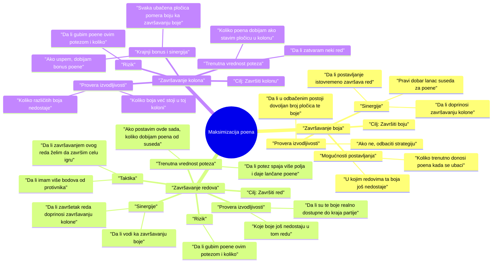
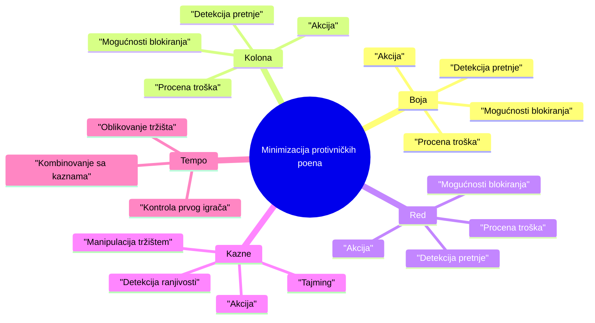

# AIZUL - Ekspertski sistem za igranje društvene igre Azul

Članovi tima:
- Boris Markov SV73/2021
- Gojko Vučković SV49/2021

# Opis problema

### Motivacija

Tokom poslednje decenije industrija društvenih igara je postala mnogo razvijenija i pristupačnija prosečnom čoveku. Razvijaju se nove i moderne društve igre različitih kompleksnosti koje vrlo brzo postaju "kultni klasici" na policama kolekcionara, porodica, pa i povremenih igrača. Jedna od ovih igara, koju bismo želeli da istaknemo je upravo ***Azul*** iz 2017. godine. Smatramo da ova igra ima veliku kompleksnost i različite zanimljive strategije igranja, ali sa vrlo jednostavnim pravilima igranja. Detaljnije o igri možete pročitati [ovde](https://en.wikipedia.org/wiki/Azul_(board_game)).

Obojica volimo ovu igru i često je igramo, sa time u vidu, želimo da odamo počast ***Azul***-u i približimo ljudima time što ćemo napraviti pametnog agenta, uz kojeg će ljudi moći da interaktivno nauče da je igraju, ili unapređuju svoje veštine.

- - -
### Pregled problema

Ukratko, pravila igre su sledeća:

- Igrači skupljaju pločice (keramičke pločice različitih boja i dezena) i postavljaju ih na svoju ličnu tablu sa ciljem da ukrase zid palate. U svakoj rundi postoje krugovi („fabrike“) iz kojih se biraju pločice. Kada je igrač na potezu, on izabere sve pločice iste boje iz jedne fabrike i prenese ih na jednu od svojih redova za pripremu. Sve ostale pločice iz te fabrike premeštaju se u centralni krug i odatle ih kasnije igrači mogu uzimati.

- Kada se svi krugovi isprazne, završava se runda i pločice iz popunjenih redova na tabli se premeštaju na odgovarajuće mesto na „zid“. Svaka postavljena pločica donosi poene u zavisnosti od toga koliko se dobro uklapa sa već postavljenim pločicama (horizontalno i vertikalno povezivanje). Ploče koje ne mogu da se smeste idu na „kaznenu liniju“ i oduzimaju poene.

- Igra traje dok neki igrač ne popuni jedan horizontalni red na svom zidu. Nakon toga sledi završno bodovanje – dodatni poeni se dobijaju za kompletne redove, kolone ili svih pet pločica iste boje. Pobednik je igrač sa najviše osvojenih poena.

*Slika 1 - Prikaz jednog stanja table igrača*

Nalik šahu, pravila igre su prilično jednostavna, međutim postoji bezbroj različitih strategija za igranje i odabir najboljeg poteza može biti vrlo kompleksan. Sa time, želimo da napravimo agenta sa osnovnom funkcionalnošću da odredi najbolji mogući potez u datom stanju table.

Većina implementacija ekspertskih sistema za igranje tabličnih igara poput ***Azul*** su zasnovana na algoritmima poput ***minimax***, ***Monte Carlo Tree Search*** ili ***mašinskog učenja***. Interaktivni sistemi koji su namenjeni da objasne i nauče igrače da igraju se često zadržavaju samo na jednoj rundi (ili par njih) koja je skoro uvek unapred predodređena i linearna bez prilike za učenje kompleksnih strategija. Sa time, naš projekat bi zasnovali na *pravilima*, *forward i backwards chaining*, i *complex event processing* (za šta smatramo da je ***Azul*** naročito pogodan), sa funkcionalnošću da **objasni odluku svog poteza koji smatra optimalnim**. Verujemo da će ovakav pristup omogućiti korisnicima da bolje nauče da igraju ***Azul*** od drugih već postojećih rešenja.

Primeri implementacija, inspiracije i relevantna literatura:
1. [AlphaGo - program koji igra tabličnu igru Go](https://deepmind.google/research/projects/alphago/)
2. [AzulAI - *"program koji igra Azul bolje od čoveka"*](https://domwil.co.uk/posts/azul-ai/#comparison)
3. [The Design of Azul - analiza i tekst o tome šta je dobar izbor u igrama](https://jboger.medium.com/the-design-of-azul-8ab36d21d3a5)

- - -
### Metodologija rada

Sistem je podeljen u tri koherentna sloja koji rade zajedno:

1. Forward Chaining Layer
- Lanac pravila kroz koji će svaki od mogućih poteza proći, u njemu uključujemo taktičko i strateško rezonovanje. On će sadržati velik broj pravila koja dodeljuju ili oduzimaju bodove po kojima određujemo koliko je potez dobar (primere tih pravila možete videti u sledećem poglavlju).
  
	- Ulaz: trenutno stanje igre (table, fabrike, centar, redovi poda, protivnici).
	- Izlaz: lista mogućih poteza sa score-om (Move objekti).

2. CEP Layer
- Praćenje globalnih obrazaca u toku igre (konflikt oko resursa, padanje velikog broja pločica u centralnu fabriku, kraj igre...).
  
	- Ulaz: lista poteza, događaja iz runde (log) i stanje table.
	- Izlaz: modifikacija score-a poteza, ne bira potez direktno.

3. Backward Chaining Layer
- Proverava da li predloženi potez zadovoljava dugoročne ciljeve u zavisnosti od faze igre, može menjati (više o tome u poglavlju za backward chaining).
  
	- Ulaz: lista poteza sa score-om.
	- Izlaz: filtrirani potezi → finalni potez.

#### Forward chaining

Možemo posmatrati pravila na dva načina, ona koja imaju u obzir kratkoročnu nagradu (taktika) i ona koja imaju u obzir dugoročnu nagradu (strategija). Sa time u vidu, implementirali bi jedan dugačak lanac pravila koji bi neformalno bio podeljen na dva dela:
1. Taktika:
	- Završavanje reda (ogroman plus)
 	- Kaznena linija (minus)
  	- Blokiranje protivnika (velik plus)
   	- Ako potez završava red i u velikoj smo prednosti u odnosu na protivnika (ogroman plus)
   	- ...
2. Strategija:
   	- Dodaje pločicu u red koja je blizu da dovede do bonus poena (velik plus)
   	- Dodaje pločice u centar koje će naterati protivnika da mu određen broj pločica upadnu u minus (mali plus)
   	- Popunjujemo red bez ikakve kazne (srednji plus)
   	- Pločica/ce popunjuje/ju najduži red (velik plus)
   	- ...

#### CEP (Complex Event Processing)

U našem sistemu implementiraćemo dva CEP modula koji prate obrasce u toku igre i modifikuju score poteza:

1. **KonfliktResursa (ResourceConflictCEP)**  
   - **Tip događaja:** punctual event (posmatramo svaki potez, simuliramo vremenski tok)  
   - **Opis:** prati koje boje pločica traže svi igrači u trenutnom potezu.  
   - **Cilj:** povećati vrednost poteza koji **oduzimaju boje od protivnika** ili biraju boje koje su tražene od više igrača.  
   - **Windowing:** sliding window sa dužinom od 1 poteza (diskretno) – formalno simuliramo vremenski okvir.  
   - **Evaluacija:** diskretna, score se odmah modifikuje za taj potez.  
   - **Clock:** runtime clock, reaguje na svaki potez.

2. **OmetajućeBiranje (InterfearingChoiceCEP)**  
   - **Tip događaja:** interval event (posmatra se cela runda, simuliramo interval vremena)  
   - **Opis:** prati koliko puta je igrač tokom runde uzimao svaku boju pločica.  
   - **Cilj:** povećati vrednost **bojama koje igrač još nije završio** a protivnik ih često uzima
   - **Windowing:** interval-based, cela runda = interval (diskretno, formalno kao vremenski prozor)  
   - **Evaluacija:** diskretna, score modifikovan nakon svake runde  
   - **Clock:** runtime clock, evaluacija se dešava na kraju runde  

**Napomena:**  
- Prvi CEP (**KonfliktResursa**) daje prioritet kratkoročnim potezima, dok drugi CEP (**SekvencaBoja**) daje strategijski prioritet za celu rundu.  
- Formalno prikazujemo vremenski tok (pojedinačni potezi i interval runde) kako bismo zadovoljili koncept CEP-a, ali u praksi se koristi samo diskretna analiza poteza i runde.  
- Obe evaluacije se primenjuju pre backward chaining modula, koji filtrira poteze prema dugoročnim ciljevima.
  
#### Backwards chaining

Dugoročni ciljevi variraju u zavisnosti od toga koliko rundi se već odigralo, koja je veština protivnika, subjektivnog mišljenja igrača koja je najbolja strategija za pobeđivanje u igri i samog toga igre. Sa time u vidu, implementiraćemo različite dugoročne ciljeve sistema koje ćemo uključivati/isključivati. Sa obzirom da jedna runda sadrži više poteza igrača, na kraju runde je idealna prilika da evaluiramo naš dugoročni cilj i promenimo ga po potrebi; takođe CEP bi bio jedan od okidača za menjanje cilja. Backwards chain modul je taj koji na kraju presudi koji je najbolji potez na osnovu našeg cilja. Ciljeve koje bi razmatrali za izradu su sledeći:

1. Završavanje kolone u najmanjem broju poteza
2. Završavanje svih 5 polja iste boje
3. Maksimizacija naših bodova
4. Minimizacija protivnikovih bodova
5. Imanje što više različitih boja u šemi za pločice

Formalno, svaka od ovih strategija bi znatno povećala vrednost poteza koji ispunjavaju cilj, ostali potezi će ostati bez promene prioriteta.

Za kraj uzimamo potez koji ima najveći score nakon svih obrada i evaluacija. U slučaju da više njih ima isti score, rangiraćemo pločice po tome koje su nam najlepše i njima dati prioritet. Ako opet imamo isti score, izabraćemo nasumično.

### Prvi backward chain

### Glavni cilj : **Maksimizacija ukupnih poena**
---
##### Podciljevi
1. Završavanje boja  
2. Završavanje redova  
3. Završavanje kolona  
---
#### 1. Završavanje boja
**Opis**: Ako uspeš da popuniš svih 5 polja iste boje na tabli, dobijaš **+10 poena na kraju igre**. Ovo je dugoročna strategija.

**Lanac zaključivanja unazad**:
- *Cilj*: Završiti boju (npr. plavu).
  - **Provera izvodljivosti**
    - Da li u odbačenim postoji dovoljan broj pločica te boje da se završi svih 5?
    - Ako ne → odbaciti strategiju.
  - **Mogućnosti postavljanja**
    - U kojim redovima ta boja još nedostaje?
    - Koliko trenutno donosi poena kada se ubaci? (bodovi suseda)
  - **Sinergije**
    - Da li postavljanje tog polja istovremeno završava red (+2)?
    - Da li time doprinosi završavanju kolone (+7)?
    - Da li pravi dobar lanac suseda za susedne poene?
---
#### 2. Završavanje redova
**Opis**: Ako popuniš ceo red, dobijaš **+2 poena na kraju igre**. Ovo je lakše dostižno nego završavanje boje ili kolone
**Backward chain**:
- *Cilj*: Završiti red (npr. red 3).
  - **Provera izvodljivosti**
    - Koje boje još nedostaju u tom redu?
    - Da li su te boje realno dostupne do kraja partije?
  - **Trenutna vrednost poteza**
    - Ako postavim ovde sada, koliko dobijam poena od suseda?
    - Da li ovaj potez istovremeno spaja više polja i daje lančane poene?
  - **Sinergije**
    - Da li završetak reda doprinosi završavanju neke kolone?
    - Da li istovremeno vodi i ka završavanju boje?
  - **Rizik**
    - Da li gubim poene ovim potezom i ako da koliko ih gubim?
  - **Taktika**
    - Da li završavanjem ovog reda želim da završim celu igru, da li imam više bodova od protivnika?

---

#### 3. Završavanje kolona
**Opis**: Ako popuniš celu kolonu, dobijaš **+7 poena na kraju igre**. Ovo je teže, jer zahteva svih 5 različitih boja u toj koloni, ali zato donosi veću nagradu.

**Backward chain**:
- *Cilj*: Završiti kolonu (npr. kolona 4).
  - **Provera izvodljivosti**
    - Koliko boja već stoji u toj koloni?
    - Koliko različitih boja nedostaje?
  - **Trenutna vrednost poteza**
    - Koliko poena trenutno dobijam ako stavim pločicu u ovu kolonu?
    - Da li tim potezom zatvaram neki red (+2)?
  - **Krajnji bonus i sinergija**
    - Ako uspem, dobijam +7.
    - Istovremeno svaki ubačeni element pomera i boju ka završavanju boje.
  - **Rizik**
    - Da li gubim poene ovim potezom i ako da koliko ih gubim?

   
    
### Drugi backward chain

### Glavni cilj
**Minimizovati ukupne poene protivnika**

#### Podciljevi
1. Sprečiti **završavanje boje** (+10)  
2. Sprečiti **završavanje kolone** (+7)  
3. Sprečiti **završavanje reda** (+2)  
4. **Izazvati kaznene poene**
5. **Pokvariti tempo i tok runde** (manipulacija fabrikama/discardom, prvi igrač)

---

#### 1) Blokiranje završetka **boje**

**Cilj:** Onemogućiti da protivnik skupi svih 5 pločica iste boje do kraja igre (**+10**).

**Lanac unazad:**
- **Detekcija pretnje**
  - Da li protivniku fali manje od 2 pločice iste boje do kompleta?
  - Na tabli/fabrikama postoje te pločice ove runde?
  - Da li je realno da ih uzme pre mene (redosled, broj igrača)?
- **Mogućnosti blokiranja**
  - Mogu li uzeti *upravo tu boju* dovoljno rano da ih razbijem na više gomila ili ih potpuno uklonim sa tržišta?
  - Mogu li *namerno* pokupiti višak te boje i uzeti kaznu, ali kupiti vreme?
- **Procena troška**
  - Koliki je moj trošak naspram sprečenih **10** poena?
- **Akcija**
  - Ako je sprečavanje bitnije od sopstvenog gubitka, uzmi boju.
---

#### 2) Blokiranje završetka **kolone**

**Cilj:** Sprečiti kolonu (+7).

**Lanac unazad:**
- **Detekcija pretnje**
  - Koliko polja nedostaje protivniku u koloni?
  - Koje **različite** boje su potrebne i da li su na tržištu ove runde?
- **Mogućnosti blokiranja**
  - Uzmi jednu od neophodnih boja za tu kolonu **pre** protivnika.
  - Usmeri tržište tako da te boje odu u centar, povećavajući kazneni rizik.
- **Procena troška**
  - Vrednost sprečenih 7 poena protiv moje trenutne vrednosti poteza.
- **Akcija**
  - Prvenstvo imaju boje koje su **retke u rundi** (manja verovatnoća da se ponove kasnije).
---

#### 3) Blokiranje završetka **reda**

**Cilj:** Sprečiti red (+2), često taktički u završnici runde.

**Lanac unazad:**
- **Detekcija pretnje**
  - Da li protivniku fali **samo 1 pločica** da završi red?
  - Da li ta pločica donosi i dobre bodove suseda?
- **Mogućnosti blokiranja**
  - Uzmite tu boju ili razbijte paket u fabrici da mu se uslovi promene.
  - Ako je kasna runda – omogućite da mu ostane loš izbor.
- **Procena troška**
  - Sprečeni bodovi protiv naše vrednosti poteza.
- **Akcija**
  - Blokiraj pre svega redove koji mu otvaraju **kolonu** ili **boju**.
---

#### 4) Izazivanje **kaznenih poena**

**Cilj:** Naterati protivnika da **prelije** i dobije minus poene.

**Lanac unazad:**
- **Detekcija ranjivosti**
  - Protivnik ima skoro popunjene pripremne redove za više boja
  - Koliko mu je prostora ostalo bezbedno?
- **Manipulacija tržištem**
  - Gurnuti *više istih boja* u centar.
- **Tajming**
  - Ako će protivnik igrati **posle mene** i **mora** uzeti određenu boju → rizik kazne raste.
- **Akcija**
  - Birati poteze koji maksimalizuju verovatnoću da **mora** uzeti “prevelik” paket.
---
#### 5) **Tempo** i tok runde (fabrike, centralni pool, prvi igrač)

**Cilj:** Pokvariti planiranje protivnika kroz redosled i sadržaj poteza.

**Lanac unazad:**
- **Kontrola prvog igrača**
  - Da li uzimanjem **prvog igrača** (žetona) mogu da:
    - Uđem pre njega u ključnu boju u sledećoj rundi?
    - Nametnem ranu blokadu boje/kolone?
- **Oblikovanje tržišta**
  - Razbij grupe koje su dobar potez protivniku i prebaci protivniku neželjene boje u centar.
- **Kombinovanje sa kaznama**
  - Pusti da u centru narastu grupe koje njemu kvare raspored.
 

#### Ulaz programa
- Stanje table svakog od igrača
	- Zid
	- Šema za pločice
	- Red poda
- Stanje fabrika i centra stola
- Log svih poteza odigranih u rundi
- Broj igrača
#### Izlaz programa
- Predlog poteza
- Rezonovanje izbora
#### Baza znanja
- Pravila igre
- Heuristike za donošenje odluka
- Šabloni tipičnih situacija i primećena ponašanja igrača
  
- - -
### Rezonovanje konkretnog primera

1. **Stanje igre**  
   - Fabrika A: 2 crvene pločice  
   - Fabrika B: 3 plave pločice  
   - Centar: 1 žuta i 1 crna pločica  
   - Igrač: red 3 (od 5) već ima 2 plave pločice, red poda je prazan  
   - Protivnik: skoro popunjen horizontalni red sa 4 crvene pločice
   - Log: protivnik je u poslednja dva poteza oba puta uzeo crvenu pločicu, a u prošloj rundi je najčešće uzimao plavu

2. **Forward Chaining** generiše sve legalne poteze:  
   - Uzmi 3 plave pločice iz fabrike B  
   - Uzmi 2 crvene pločice iz fabrike A  
   - Uzmi 1 žutu pločicu iz centra  
   - Uzmi 1 crnu pločicu iz centra  

3. **Forward Chaining evaluacija**:  
   - 3 plave → završava red, visok trenutni poen  
   - 2 crvene → ne završava red, blokira protivnika, srednji poen  
   - 1 žuta → ne završava red, legalan potez, nizak poen  
   - 1 crna → ne završava red, legalan potez, nizak poen  

4. **CEP Layer** detektuje obrasce:  
   - Ako je većina igrača uzelo istu pločicu u poslednih 2n rundi (n-broj igrača) povećaj vrednost poteza te boje, dodajemo srednji poen
     	- Protivnik je uzeo crvenu pločicu dvaput u poslednje dve runde, povećaj vrednost poteza uzimanje dve crvene pločice
   - Ako je protivnik u prošloj rundi najčešće birao određenu boju, povećaj vrednost te boje u ovoj rundi
     	- Protivnik je u prošloj rundi najčešće uzimao plavu, tako da povećavamo vrednost poteza gde biramo plavu, dodajemo nizak poen

5. **Backward Chaining evaluacija** (dugoročni ciljevi):  
   - Cilj: maksimizacija poena + blokiranje protivnika
   - 3 plave → maksimizacija poena -> treba mi plavih da zavrsim boju -> ima 3 plave, mogu da zavrsim red -> nemam dodatnih sinergija -> blokiranje protivnika -> plava ga ne utice uopste
   - 2 crvene → maksimizacija poena -> crvena nam ne pomaze da zavrsimo niti red, niti boju, niti kolonu -> blokiranje protivnika -> protivniku treba crvenih da zavrsi red -> postoji crvenih da se zavrsi red -> nama nije minus -> veliki prioritet
   - 1 žuta → maksimizacija poena -> zuta nam ne pomaze da zavrsimo niti red, niti boju,niti kolonu -> blokiranje protivnika -> protivniku ne treba zuta da zavrsi niti red niti kolonu niti boju
   - 1 crna → isti primer kao i zuta

6. **Finalna odluka**  
   - Nakon modifikacije score-a kroz Forward Chaining, CEP i Backward Chaining, **potez sa 2 crvene pločice iz fabrike A dobija najveći ukupni score**.  
   - Output:  
     > „Uzmi 2 crvene pločice iz fabrike A i stavi ih u red poda 1, zato što time blokira protivnika da završi red i balansira naš dugoročni cilj maksimizacije poena u sledećim rundama.“  

---
